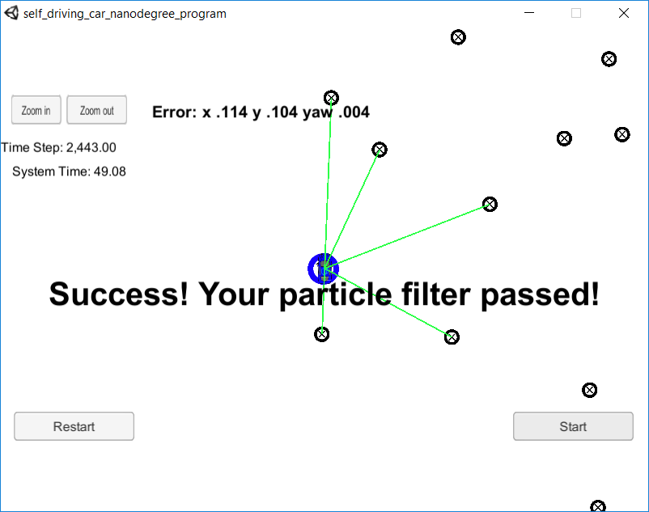

# Self-Driving Car Nanodegree Program - Term 2
## Project 3 - Particle Filter
**Ricardo Picatoste**

## Notes
The project has been compiled in Windows 10 using the "Bash on Ubuntu on Windows", generating the make file with "cmake CMakeLists.txt" and then running make. 

I have used a tab width of 4 spaces, taking care of the matrices alignment. I hope it's ok, I prefer it like that for programming.

In particle_filter.cpp, the define DEBUGGING can be set to 1 or 0 in order to print debugging information.

## Results

The test is passed in the simulator:

